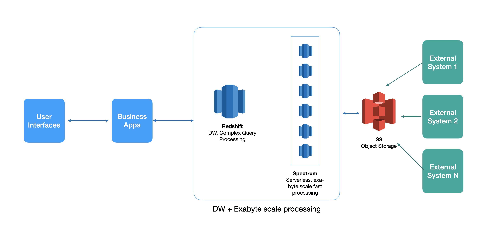

# Athena Architecture

This document describes a possible architecture that could be envisaged for a GC breakage forecast platform. It necessarily
does not depict the software implemented by this repository currently. 

## Architecture (30K feet view)

## Architectural Considerations
TODO

## Architectural Principles
TODO

## Technology Options
TODO

## Technology Fitment
TODO