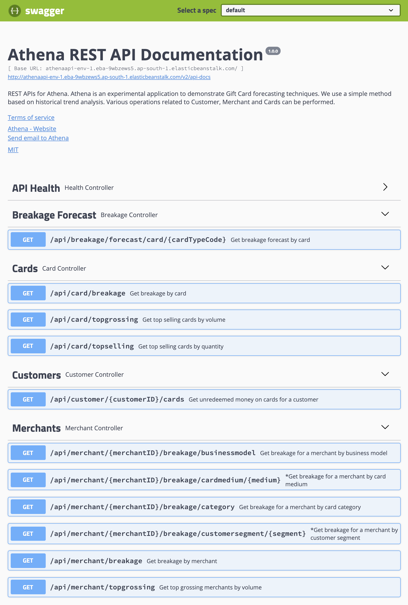

# Athena Development

If you want to build **athena** from source , follow the steps mentioned here.

## System Requirements (for building and running Athena)

- Memory: 2 GB minimum, 8 GB recommended
- CPU Cores: 2 Cores, 4 Cores recommended
- Docker: Version 19+ (if you want to run tests locally)
- Java: JDK 11
- Gradle: Bundled via wrapper, but locally installed Gradle v1.65 helps.

> To run the athena REST API app, you would need credentials of the Amazon Redshift cluster. However, for running the tests locally, you won't need Redshift since 
> local integration tests use a local PostgreSQL DB instead of a full blown Amazon Redshift - the same queries work on both PostgreSQL and Amazon Redshift equally well with very few minor exceptions(e.g. `distkey` and `sortkey` which are Redshift specific). Furthermore, you don't need to install PostgreSQL locally yourself, just leave your
> Docker daemon running and the test automatio will automatically pull in PostgreSQL during test execution.

## Build and run tests
- The integration tests would require your Docker daemon to be running. (Install Docker Desktop locally and start it)
- Now issue the following commands in a terminal window to checkout code and build.

    ``` 
    # Checkout from GitHub
    git clone git@github.com:arunkpatra/athena.git
  
    # Build
    cd athena
    ./gradlew assemble
  
    # Run tests
    ./gradle check
    ```

## Running the Athena API App

- Export environment variables
    ``` 
    export DB_URL=<your_redhisht_jdbc_url>
    export DB_USER=<your_readshift_cluster_user>
    export DB_PASSWORD=<your_readshift_cluster_password>
    ``` 
- Starting the Athena Spring Boot app (the REST API app)
    * Ensure that your Redshift cluster is running and shows an `Available` status. Make sure to setup permissions based
    on your environment, and you have IAM roles setup correctly. The end result should be that, **you should be able to
    access Redshift via the Redshift JDBC driver from the machine and network you intend to start the Athena REST API app**.
    * Ensure that you have loaded data into the S3 bucket. See `subprojects/athena/redshift-data-load.sql` for bucket 
    and file names. You can upload all the files in the `subprojects/athena/data/` directory to your S3 bucket. 
    Provide permissions as necessary.
    * Ensure that you have run the `subprojects/athena/athena-schema.sql` script. If you run this in the Redshift Editor directly.
    * Now run the Athena REST APi app
        ``` 
        cd athena
        ./gradlew bootRun
        ```
    * Access **Swagger UI** at http://localhost:8080/swagger-ui.html. You should be able to invoke API calls.  
    

## Kubernetes Deployment

- You can create the docker image for `athena-api` using `gradle buildDockerImage`.
- Push it to a local Docker registry (listening at port 5000) using `gradle pushDockerImage`
- Deploy to a locally running Kubernetes cluster using `kubectl apply -f athena-deployment.yaml` from the `subprojects\athena-deployment\kubernetes` directory.
- API will be available at http://localhost:30000/swagger-ui.html
- Cleanup. Delete the application from the cluster using `kubectl delete -f athena-deployment.yaml` from the `subprojects\athena-deployment\kubernetes` directory.

> You **must edit** the athena-deployment.yaml file and provide valid values for your Amazon Redshift cluster, Redshift user and password. 
> Before you can run data load scripts, you need to copy data to your S3 bucket from the `subprojects\athena-data\data\*.csv` files. Also based on your bucket name, edit the `subprojects\athena-data\data\redshift-data-load-v2.sql` file.
> Load test data to your cluster by first running the `subprojects\athena-data\data\athena-ddl-v2.sql` script and then the `subprojects\athena-data\data\redshift-data-load-v2.sql` script.
