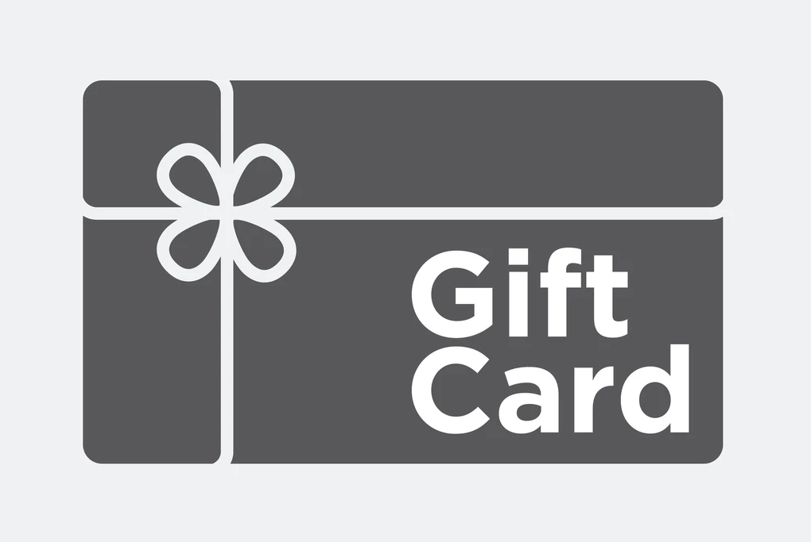

US shoppers spent around **$40 Billion** this year on Gift Cards. Historically speaking, around **$1.2 Billion** of this will
be left unredeemed. Based on existing regulation in various states, governments can claim away this money from 
businesses selling these gift cards. Interestingly, as one is aware, its best to ensure that customers redeem gift cards 
as much as possible. That **increases the chances of uplift**, acquire new customers, promote new business and actually allow
the business to **keep the revenue from the gift card sales** at the first place (technically speaking in accounting terms, 
the GC sale revenue is nothing more than a liability on the books till the consumer actually redeems the gift card!)

## The problem: What business actually wants?

1. Minimize escheatment. Its just a risk and doesn't help my business. Solve the breakage problem to start with please.
2. Maximize uplift. That's a major success criteria for my business.

## The expectation: What business needs to meet stated goals?

1. Give me tools to predict breakage values each quarter by card type. I need this for planning and protect my Gift card business better. 
2. Give me tools to notify customers and hence prevent breakage, thereby creating uplift. This is a key success factor for Athena.

## The approach: How do we meet business expectations?

1. Either use historical data around breakage or train a model to predict breakage numbers. Find out when redemption
chances become remote. 
2. Try to formulate a 'smart' strategy to trigger notifications to the customer so that chances of actual redemption
are highest. A 'dumb' strategy would be to just trigger notifications a week or two weeks prior to expiry. The smartness
factor is a function of multiple parameters that might include customer profile, situational aspects, in store/online
 offers etc. We must try everything possible to not only just prevent breakage, but create uplift. Historically,
 65% customers have a likelihood of spending 38% more than the gift card value. Tap this opportunity and I'll call Athena
 successful.
3. Build a solution that scales with data volumes, is dynamic enough to cater to dynamic escheatment regulation and enables
the smart insights mentioned above.
 
## The architecture: How does the blueprint of the solution look like?
See [ARCHITECTURE.md](ARCHITECTURE.md)

## Key Usecases: Where the rubber meets the road

1. As a gift card issuer, I want to see by card type, breakage probability and projected breakage value at a given point
in time. A simple UI is just fine. If you can aggregate by brand, that's awesome. If you can show me an overall predicted
escheatment value for my business, it would be great.

2. As a gift card issuer, I want the system to tell me the best possible time when notifications should be generated to
customers so that I can maximize uplift. It's awesome to see a predicted uplift value in response to this action that
was taken.

## The design: How do I engineer the solution?
See [ARCHITECTURE.md](ARCHITECTURE.md)

## The engineering: Ensure, that we deliver great quality, fast, with every release. Move it!
See [DEVELOPMENT.md](DEVELOPMENT.md)