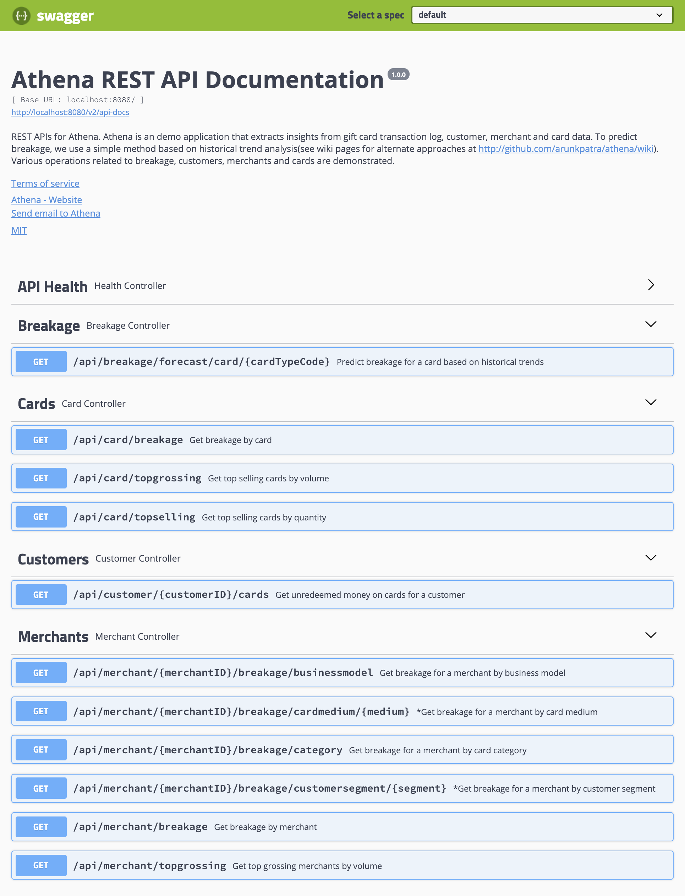

 

## Highlights of this Repo [WIP]
| Highlight        | Notes           |
| :------------- |:------------- | 
| **Demo Site**      | A endpoint hosting REST APIs that this repository delivers. The REST APIs execute live queries on the Amazon Redshift. [REST API Demo URL](http://athenaapi-env-1.eba-9wbzews5.ap-south-1.elasticbeanstalk.com/swagger-ui.html) (Status: Switched OFF for now) | 
| **Scaling Athena**      | Thoughts on how to scale this application to extreme levels beyond the expectations of the [current programming challenge](https://github.com/arunkpatra/athena/issues/11).  <ul><li>[How to scale to exabytes of data](https://github.com/arunkpatra/athena/wiki/Scaling-Athena-DW-:-Redshift)</li><li>[How to elastically scale Athena's REST APIs](https://github.com/arunkpatra/athena/wiki/Elastically-Scaling-Athena-APIs)</li></ul> | 
| **Technology Stack** | This repo uses a variety of technologies using Java, Spring Data, Gradle, JUnit, **Amazon Redshift** and **S3**. See [Technologies used by Athena](https://github.com/arunkpatra/athena/wiki/AWS-Technologies-Used)      |  
| **Engineering Best Practices demonstrated** | See [Engineering best practices demonstrated in this repo](https://github.com/arunkpatra/athena/wiki/Engineering-Best-Practices-adopted-by-Athena)      |  
| **End to end implementation** | This repo implements a set of use cases with working automated tests. See [What software components this repo implements](https://github.com/arunkpatra/athena/wiki/Software-components-implemented-by-this-repo)      |  
| **GC Breakage Forecast Approaches** | Multiple approaches on implementing a hyper scale gift card breakage forecast platform. See [Discussion on multiple approaches to forecast gift card breakage](https://github.com/arunkpatra/athena/wiki/Gift-Card-Breakage-Forecast-Approaches)      | 

## Background

US shoppers spent around **$40 Billion** last year on Gift Cards. Around **$1.2 Billion** of this was left unredeemed. Based on existing regulation in various states, governments can claim away this money from 
businesses selling these gift cards. Interestingly, as one is aware, its best to ensure that customers redeem gift cards 
as much as possible. That **increases the chances of uplift**, acquire new customers, promote new business and actually allow
the business to **keep the revenue from the gift card sales** at the first place (technically speaking in accounting terms, 
the GC sale revenue is nothing more than a liability on the books till the consumer actually redeems the gift card!). 

## Problem Statement: What business wants

1. **Minimize escheatment** - Its just a risk and doesn't help my business. Solve the breakage problem to start with.
2. **Maximize uplift** - That's a major success criteria for my business.

## Business expectation: What business needs to meet stated goals

1. Tools to predict breakage values each quarter by card type. I need this for planning and to protect my Gift card business better. 
2. Tools to notify customers and hence prevent breakage, thereby creating uplift hopefully. This is a key success factor for Athena.

## Solution Approach: How do we meet business expectations

1. Use historical data around breakage and/or train a model to predict breakage numbers. Find out when redemption
chances become remote. 
2. Try to formulate a 'smart' strategy to trigger notifications to the customer so that chances of actual redemption
improve. A 'dumb' strategy would be to just trigger notifications a week or two weeks prior to expiry. The smartness
factor is a function of multiple parameters that might include customer profile, situational aspects, in store/online
 offers etc. We must try everything possible to not only just prevent breakage, but create uplift. Historically,
 65% customers have a likelihood of spending 38% more than the gift card value. Tapping this opportunity should be a key success factor for Athena.
3. Build a solution that scales with data volumes, is dynamic enough to cater to dynamic escheatment regulation and enables
the smart insights mentioned above.

## Key Usecases: Where the rubber meets the road

1. As a gift card issuer, I want to see by card type, breakage probability and projected breakage value at a given point
in time. A simple UI is just fine. If you can aggregate by brand, that's awesome. If you can show me an overall predicted
escheatment value for my business, it would be great.

2. As a gift card issuer, I want the system to tell me the best possible time when notifications should be generated to
customers so that I can maximize uplift. It's awesome to see a predicted uplift value in response to this action that
was taken.

## Solution Architecture: How does the blueprint of the solution look like
See [ARCHITECTURE.md](ARCHITECTURE.md) for a detailed discussion.

## Development Tips
See [DEVELOPMENT.md](DEVELOPMENT.md)

## Screenshot: The proof is in the pudding

The APIs developed as part of the programming challenge:

## Mantra for Success
_Thing big, start small..._ The design and code developed as part of the programming challenge addresses a thin sliver of the broad objectives mentioned earlier.
